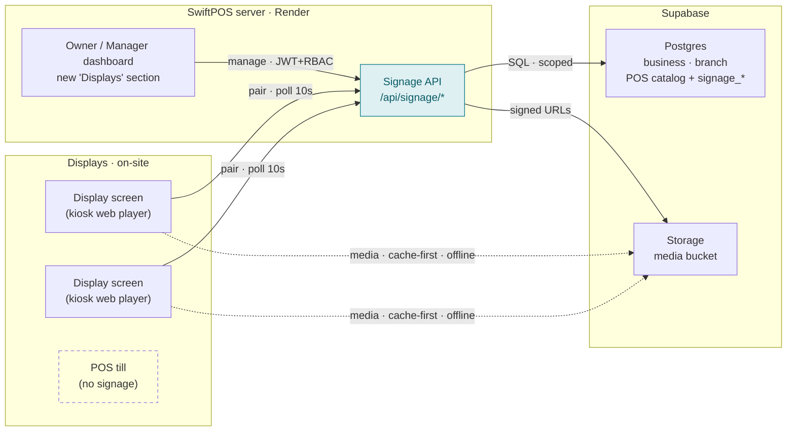
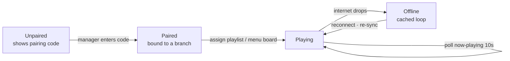

# SIGNAGE-DESIGN.md — digital signage for TVs/displays, powered by the POS

> **Status: design proposal, not scheduled.** This describes adding a
> digital-signage module (menu boards, promos, media on standalone screens) to
> SwiftPOS. Nothing is built yet; this is shared for review. A styled version
> with rendered diagrams lives at the artifact link below.
>
> Styled/shareable copy: <https://claude.ai/code/artifact/709ac121-907b-43e5-9912-6f48929fd996>

The module reuses SwiftPOS's tenancy, auth, database, and deploy — it is a new
**surface** for data the platform already owns, not a parallel stack. Screens run
on cheap Android TV sticks / smart TVs in kiosk mode; the POS tills are untouched.

---

## At a glance

| | |
|---|---|
| **Where it runs** | Standalone display screens (kiosk web player). Never on POS tills. |
| **The hook** | Live menu boards — prices, availability, and promos read straight from the POS catalog, zero double entry. |
| **Tenancy** | Screens belong to a `branch`; content scopes to a `business` — same model as everything else. |
| **Managed from** | A new "Displays" section in the owner/manager dashboard, behind an RBAC permission. |
| **Base** | SwiftPOS · Supabase (Postgres + Storage) · Render. |

---

## Principles

1. **One platform.** No second auth system, no second database. Reuse SwiftPOS
   JWT + RBAC and the Supabase Postgres the product already runs on.
2. **Screens ≠ tills.** A display is an unattended device with a very different
   trust model to a staff till. It gets its own lightweight pairing, kept
   separate from `user_devices`.
3. **Offline-tolerant.** A screen keeps playing when the internet drops — content
   and media are cached locally, matching the branch-node philosophy.
4. **Adapt, don't invent.** The Content-Manager-Pro codebase already solves
   pairing, offline media, and transcoding. We port a reviewed system, not
   greenfield.

---

## System architecture

New routes inside the existing SwiftPOS API, new tables in the existing Supabase
database, a media bucket in Supabase Storage, and a web player that runs on the
screens. Everything marked "new" is added; everything else already exists.

The only new physical thing is the screen. Menu-board content reads the **live POS
catalog** in Postgres, so prices and promos are never copied.

---

## How a screen works — lifecycle

A screen is claimed the way a set-top box is: it shows a short code, and a manager
types that code into the dashboard to bind it to their branch. From then on it
polls for what to play and caches everything it needs.

Pairing never trusts the screen with an enumerable identity: the display holds a
random registration token, the manager holds the code, and the two meet only in
the dashboard. The player token that authenticates the media feed is handed over
exactly once.

---

## Data model — new tables

Added to the existing Supabase database as new numbered SQL migrations. Every
table carries `business_id`; anything location-specific also carries `branch_id`.

| Table | Scope | Holds |
|---|---|---|
| `signage_screens` | business + branch | A physical display: name, pairing code + expiry, registration token, player token, status, orientation, last-seen, currently-assigned content. |
| `signage_screen_groups` | business + branch | Optional grouping (e.g. "Counter wall", "Drive-thru") so content assigns to many screens at once. |
| `signage_content` | business | A thing to show: `menu_board`, `slideshow`, `html`, or single `media`. Config in JSONB. |
| `signage_media` | business | Media library: file name, storage path, type (image/video), processing status. |
| `signage_playlists` + `_items` | business + branch | Ordered content with per-item duration; a screen plays one published playlist. |
| `signage_schedules` + `_entries` | business + branch | Dayparting — which playlist runs in which time window, tied to POS menu periods. |

**The one that matters:** a `menu_board` content item stores *which*
categories/layout to show — never the prices themselves. At play time the API
resolves live products, **branch-specific prices**, and active promotions. Change
a price once in the POS and every board updates.

---

## API surface

Admin routes are staff-facing and sit behind the normal JWT + RBAC. Player routes
are screen-facing and authenticate with a per-screen HMAC token — no user session
ever reaches a TV.

### Admin — JWT + RBAC (`signage.manage`)

| Method | Route | Purpose |
|---|---|---|
| GET/POST/PATCH/DELETE | `/api/signage/screens` | Manage displays; list is branch-scoped for managers. |
| POST | `/api/signage/screens/pair` | Claim a code shown on a screen → binds it to the branch. |
| GET/POST/PATCH/DELETE | `/api/signage/content` | Menu boards, slideshows, HTML cards. |
| GET/POST/PATCH/DELETE | `/api/signage/playlists` | Sequencing + publish. |
| GET/POST | `/api/signage/media` | Library + request a signed upload URL. |
| GET/POST/PATCH | `/api/signage/schedules` | Dayparting windows. |

### Player — per-screen HMAC token

| Method | Route | Purpose |
|---|---|---|
| POST | `/api/signage/player/register` | Screen boots → gets a display code + registration token. |
| POST | `/api/signage/player/register/status` | Screen polls until claimed → receives its player token (once). |
| GET | `/api/signage/player/now-playing` | Current playlist / resolved menu board + media URLs. Doubles as a heartbeat. |
| GET | `/api/storage/signage/objects/*` | Media bytes, Range-enabled, cached offline by the service worker. |

---

## Porting map — Content-Manager-Pro → SwiftPOS

The signage codebase exists today as a standalone app. What each concept becomes
when it moves into SwiftPOS:

| Standalone signage | Inside SwiftPOS |
|---|---|
| `account_id` (tenant) | `business_id` |
| — (no location) | `branch_id` added — screens are per-location |
| scrypt + DB sessions | Supabase Auth / JWT + `requireAuth` + RBAC |
| Drizzle ORM on raw Postgres | Supabase client, tables via numbered SQL migrations |
| local-filesystem object storage | Supabase Storage (S3 driver — drop-in for the pluggable layer) |
| Yodeck-style device pairing | kept as-is — separate from `user_devices` (staff tills) |
| now-playing polling | polling first; Supabase Realtime later (Phase 2) |
| Expo mobile player | dropped — web player in a TV browser / Android WebView |

**Why the storage line is easy:** the signage server's object storage was
refactored off its old cloud lock-in into a pluggable driver. Adding a Supabase
Storage backend is a single new driver behind the same interface — nothing else in
the app changes.

---

## Dashboard integration

A new nav group in `DashboardLayout`, gated by an RBAC permission so it appears
only for roles that should see it. Managers see their branch's screens; owners see
all. Placement sits alongside `Terminals` and `Printers` under a device-oriented
group — screens are just another fleet the branch operates.

- **Screens** — pair, name, group, and monitor displays (online / offline / last seen).
- **Menu Boards** — pick categories & layout; preview against live branch prices.
- **Content & Media** — slideshows, promo cards, image/video library.
- **Playlists & Schedules** — sequence content; set dayparting windows.

New permission key: `signage.view` / `signage.manage`.

---

## Delivery — three phases, value first

The differentiator — a menu board off the live POS catalog — ships first, on
roughly a tenth of the code. Generic CMS depth and realtime come after.

### Phase 0 · MVP — Menu board *(start here)*
- `signage_screens` + pairing
- Web player (kiosk) with the offline cache
- One content type: `menu_board` off live catalog + branch prices + promos
- Dashboard: Screens + Menu Boards
- No media library, no transcode yet

### Phase 1 · CMS — Media & playlists
- Media library on Supabase Storage
- Slideshow / HTML / image / video content
- Playlists + video transcode (ffmpeg on Render)
- Screen groups & scheduling

### Phase 2 · Scale — Realtime & offline
- Supabase Realtime push to screens (instant updates)
- Branch-node local serving when the internet is down
- Dayparting tied to POS menu periods

---

## Open decisions (before building)

1. **Where does the signage API live?** New routes in `apps/server` (one deploy,
   shared auth) vs a dedicated Render service (isolates the ffmpeg workload).
   **Recommend** in-server for Phase 0; split out only if transcode load justifies
   it in Phase 1.
2. **One ORM or two?** Porting signage's Drizzle queries verbatim is faster, but
   SwiftPOS is all Supabase-client. **Recommend** reusing the query *logic* but
   rewriting to the Supabase client, to avoid two data layers in one server.
3. **Realtime now or later?** 10-second polling is simple, offline-friendly, and
   plenty for menu boards. **Recommend** polling through Phase 1; add Realtime only
   where instant updates earn their keep.
4. **Video hosting cost?** Supabase Storage egress adds up if many screens re-pull
   video. Offline cache-first mitigates most of it; revisit a CDN in front of the
   bucket if it becomes material.

---

## Head start — what we don't have to build

Content-Manager-Pro is a security-reviewed signage system already. The integration
adapts it — these parts come along for free:

- **Device pairing** — brute-force-resistant codes, atomic one-time token handoff, non-enumerable screen identity.
- **Offline media cache** — service worker, cache-first with HTTP Range, streamed downloads that don't OOM cheap TV boxes.
- **Video transcode** — 1080p H.264 pipeline with crash recovery and in-place replacement.
- **Playlist & schedule domain** — sequencing, dayparting, publish flow.
- **Pluggable object storage** — already refactored to swap backends; Supabase Storage is one new driver.

---

*Architecture proposal, 2026-08-17. Not scheduled for build; shared for review.
Nothing in the SwiftPOS or Content-Manager-Pro codebases was changed to produce
this document.*
