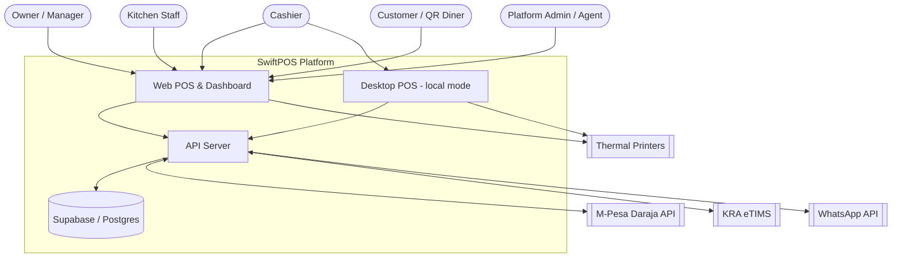
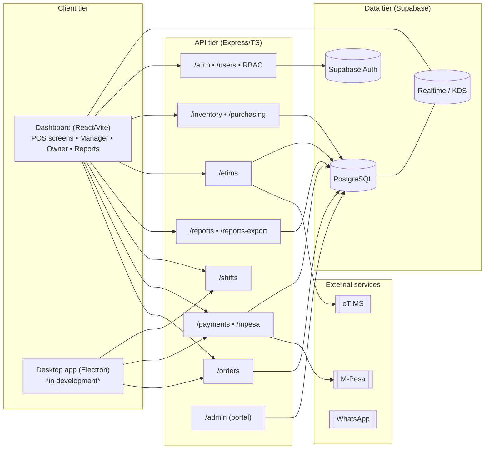
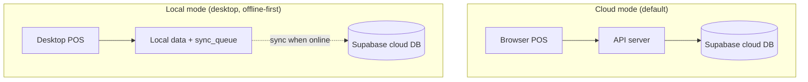
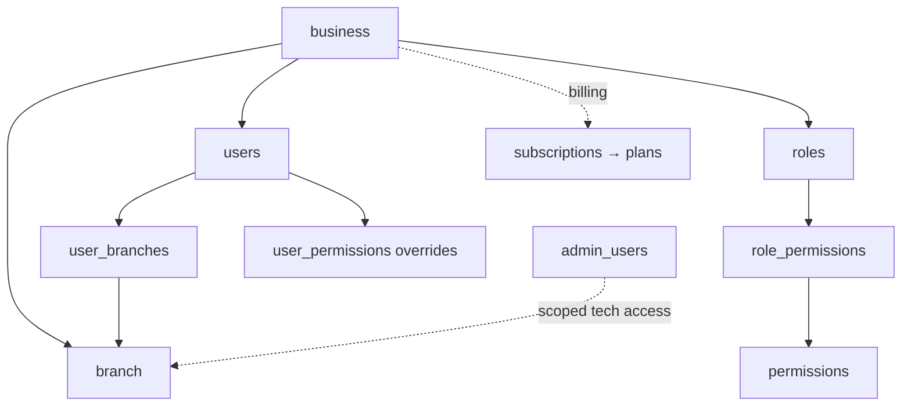

# 1. System Architecture

## 1.1 Context diagram

How SwiftPOS sits among its users and external services.

## 1.2 Container / component diagram

## 1.3 Deployment modes

Each **branch** has a `deploy_mode` of `cloud` or `local`, switchable via an
audited request flow (`mode_switch_requests`).

Offline resilience is built on three tables: `sync_queue` (pending operations with
`retry_count`), `sync_log` (push/pull outcomes), and per-row `sync_status`
(`pending` / `synced` / `conflict`) on transactional tables such as `orders`,
`payments`, and `stock_adjustments`.

## 1.4 Multi-tenancy & access model

- **Tenant root**: `business` → one or more `branch` rows.
- **Staff**: `users` (PIN-authenticated) assigned to branches via `user_branches`,
  with a `role` granting `permissions`, plus per-user `user_permissions` overrides.
- **Platform staff**: `admin_users` (super_admin / agent) operate the admin portal and
  obtain time-boxed, audited branch access via `tech_access_tokens`.
- **Billing**: `subscriptions` link a business to a `plan` (branch/user caps, features);
  `usage_snapshots` and `feature_flags` govern entitlements.

## 1.5 Tech stack summary

| Concern | Choice | Notes |
|--------|--------|-------|
| Web client | React + TypeScript + Vite | POS + dashboards + reports |
| Desktop client | Electron | Local/offline mode, in development |
| API | Express + TypeScript | REST, server is the money authority (re-prices orders) |
| DB | PostgreSQL via Supabase | RLS, Auth, Realtime |
| Auth | Supabase Auth + PIN | Owners via Auth; cashiers via PIN hash |
| Payments | M-Pesa STK, card, cash, credit | `payments` + `customer_credit_transactions` |
| Tax | KRA eTIMS VSCU/OSCU | `etims_branch_config`, `etims_invoices` |
| Currency | KES, VAT-inclusive @ 16% | VAT extracted from gross |
