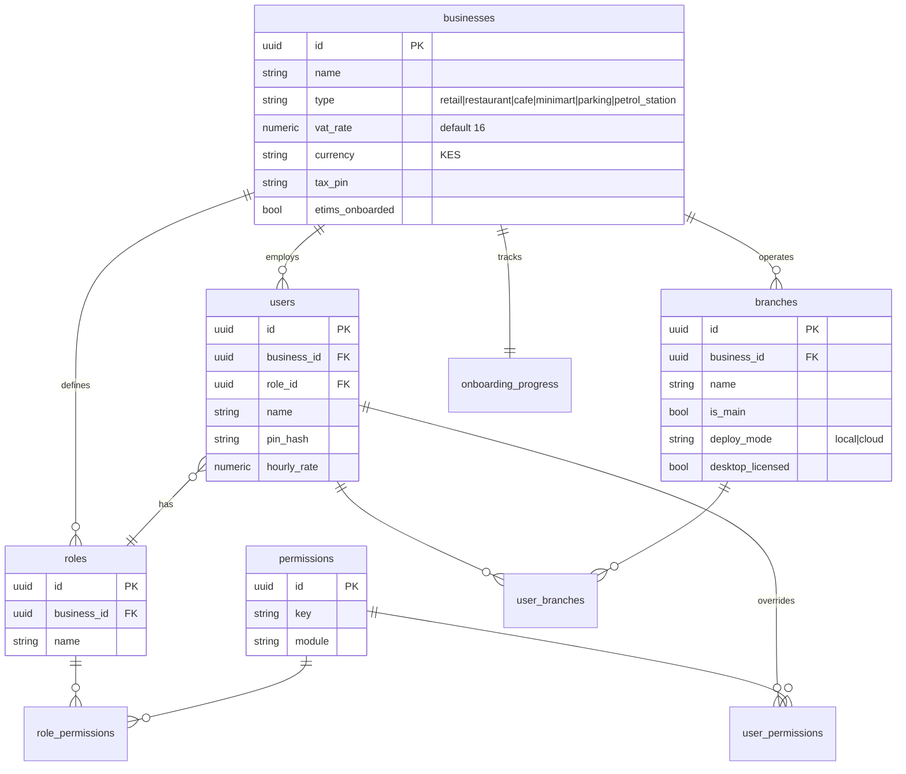
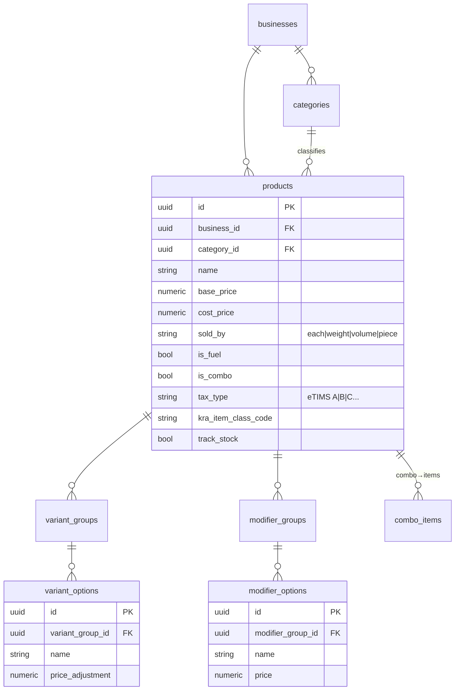
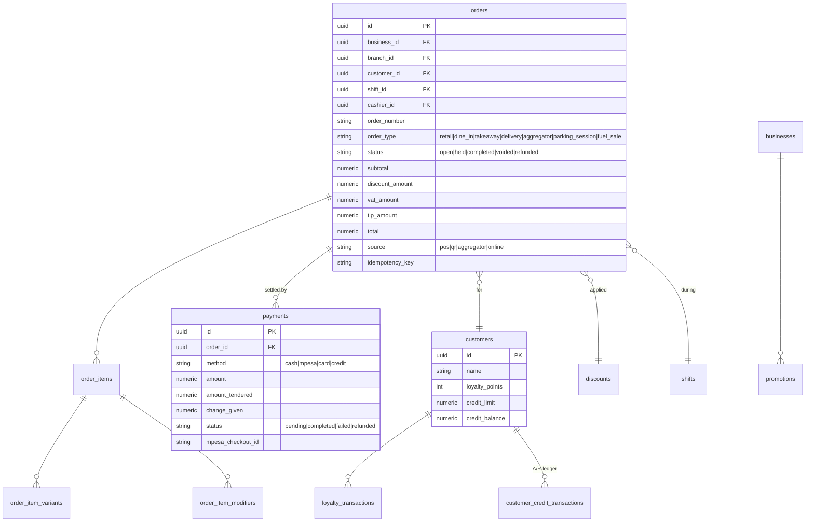
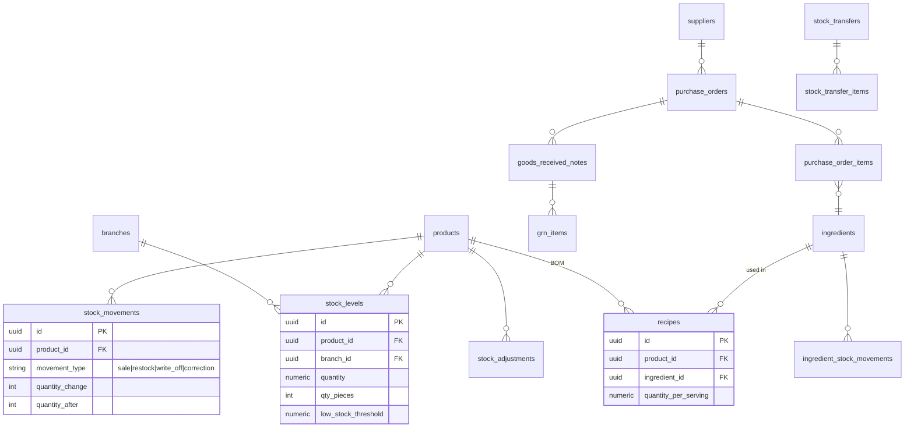
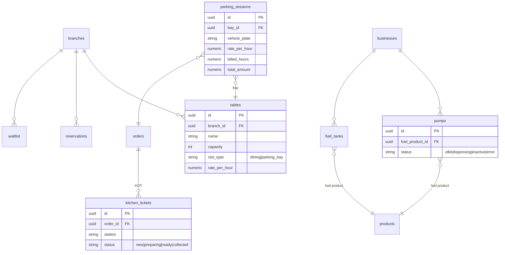
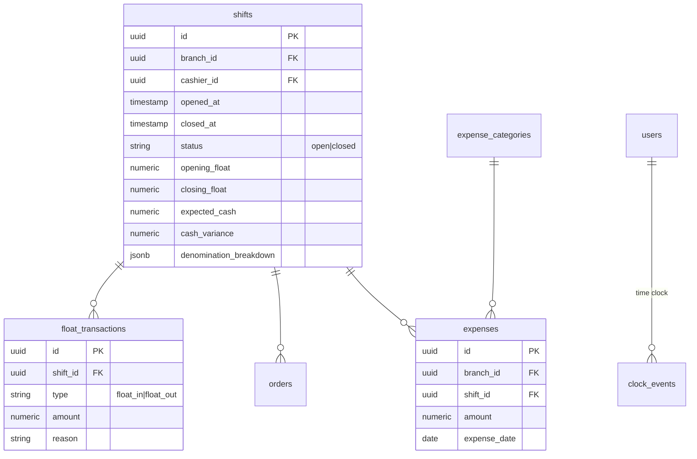
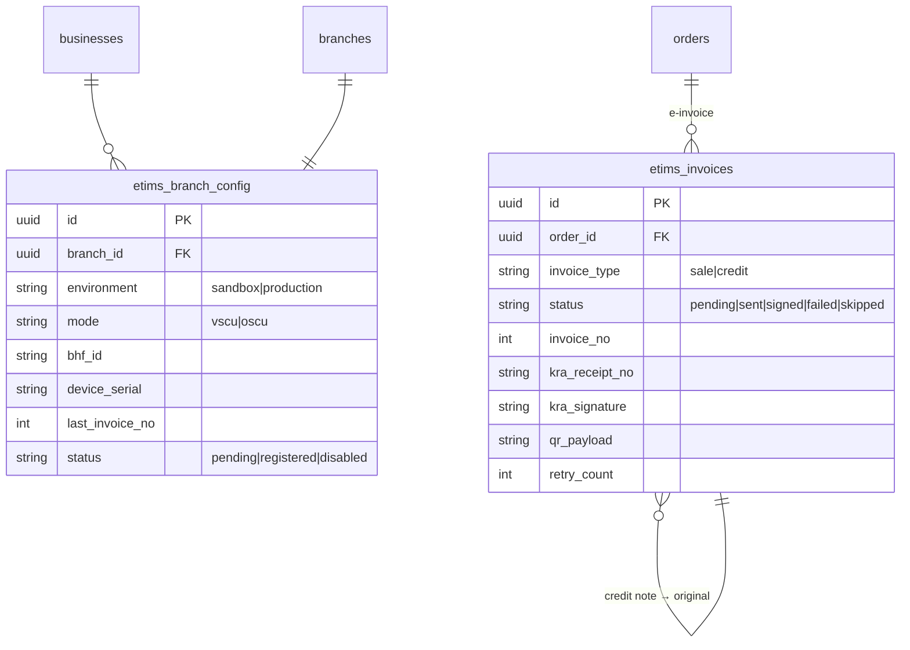
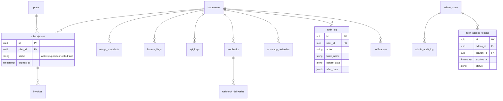

# 2. Data Model

The schema is multi-tenant: nearly every table carries `business_id` (tenant) and most
transactional tables also carry `branch_id`. Money is stored as `numeric` and is
**VAT-inclusive** (`total = subtotal − discount_amount`; `vat_amount` is the VAT embedded
in `total`). The ER diagrams below are grouped by domain for readability; a full table
catalog follows in §2.9.

## 2.1 Tenancy, staff & access control

## 2.2 Product catalog

## 2.3 Orders, payments, customers

> Note: a `payment` links to a shift only **through** `orders.shift_id` — there is no
> `shift_id` on `payments`. A `credit` payment is **accounts receivable**, recorded in
> `customer_credit_transactions`, not cash collected.

## 2.4 Inventory & purchasing

## 2.5 Restaurant, fuel & parking

## 2.6 Shifts, cash & expenses

## 2.7 Tax & eTIMS (KRA)

## 2.8 Platform, billing, integrations & audit

## 2.9 Full table catalog

| Domain | Tables |
|--------|--------|
| Tenancy & access | `businesses`, `branches`, `onboarding_progress`, `users`, `user_branches`, `roles`, `permissions`, `role_permissions`, `user_permissions`, `business_settings` |
| Catalog | `categories`, `products`, `variant_groups`, `variant_options`, `modifier_groups`, `modifier_options`, `combo_items` |
| Orders & payments | `orders`, `order_items`, `order_item_variants`, `order_item_modifiers`, `payments`, `discounts`, `promotions`, `customers`, `loyalty_transactions`, `customer_credit_transactions` |
| Inventory & purchasing | `stock`, `stock_levels`, `stock_movements`, `stock_adjustments`, `suppliers`, `purchase_orders`, `purchase_order_items`, `goods_received_notes`, `grn_items`, `stock_transfers`, `stock_transfer_items`, `ingredients`, `ingredient_stock_movements`, `recipes` |
| Restaurant / fuel / parking | `tables`, `kitchen_tickets`, `reservations`, `waitlist`, `pumps`, `fuel_tanks`, `parking_sessions` |
| Shifts & cash | `shifts`, `float_transactions`, `expenses`, `expense_categories`, `clock_events` |
| Tax / eTIMS | `etims_branch_config`, `etims_invoices` |
| Printing | `printer_stations`, `branch_printers`, `receipt_templates`, `printer_template_assignments` |
| SaaS & admin | `plans`, `subscriptions`, `invoices`, `usage_snapshots`, `feature_flags`, `admin_users`, `admin_audit_log`, `admin_client_notes`, `tech_access_tokens`, `tech_approval_flags`, `mode_switch_requests` |
| Integrations & infra | `api_keys`, `webhooks`, `webhook_deliveries`, `whatsapp_deliveries`, `notifications`, `audit_log`, `sync_queue`, `sync_log` |

## 2.10 Key conventions

- **VAT-inclusive money**: `total = subtotal − discount_amount`; `vat_amount = total − total / (1 + vat_rate/100)`.
- **Sync fields**: `sync_status` (`pending|synced|conflict`) on offline-capable tables.
- **Idempotency**: `orders.idempotency_key` prevents duplicate posting on retry/sync.
- **Soft money links**: payments → shift only via `orders.shift_id`; cash sales for a shift
  are cash payments on that shift's orders.
- **A/R**: `credit` payments increment `customers.credit_balance` and post to
  `customer_credit_transactions`.
