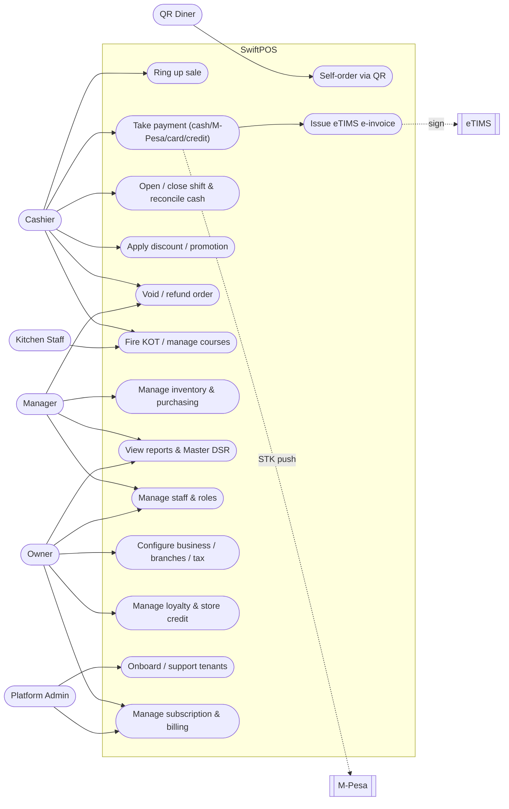

# 3. Use Cases

## 3.1 Actors

| Actor | Description |
|-------|-------------|
| **Owner** | Business owner; full access, multi-branch dashboards, billing, settings. |
| **Manager** | Branch-level oversight: reports, voids/discount approval, staff, inventory. |
| **Cashier** | Operates the POS: rings sales, takes payment, opens/closes shifts. |
| **Kitchen Staff** | Works the KDS: views KOTs, marks items preparing/ready/collected. |
| **Customer / QR Diner** | Self-orders via QR menu; receives receipts (WhatsApp). |
| **Platform Admin / Agent** | Operates the admin portal: onboarding, support, plan management. |
| **Tech Support** | Time-boxed, audited branch access for troubleshooting. |
| **M-Pesa** *(system)* | Processes STK push payments and callbacks. |
| **KRA eTIMS** *(system)* | Receives, signs, and returns e-invoices. |
| **WhatsApp** *(system)* | Delivers digital receipts. |

## 3.2 Use-case diagram

## 3.3 Use-case catalog

### POS / Sales
| ID | Use case | Primary actor | Summary |
|----|----------|---------------|---------|
| UC-01 | Ring up sale | Cashier | Add catalogue/variant/modifier/weight/PLU items to a cart; server re-prices authoritatively. |
| UC-02 | Take payment | Cashier | Settle via cash, M-Pesa STK, card, or store credit; supports split tender. |
| UC-03 | Hold / resume order | Cashier | Park an open order (`status=held`) and resume later. |
| UC-04 | Apply discount / promo | Cashier/Manager | Manual discount or auto promotion (happy hour, BOGO, qty). |
| UC-05 | Void / refund | Manager | Reverse a sale with reason; recorded for loss-prevention reporting. |
| UC-06 | Print receipt / KOT | Cashier | Route to thermal printers by template & trigger; optional WhatsApp receipt. |

### Restaurant / hospitality
| ID | Use case | Primary actor | Summary |
|----|----------|---------------|---------|
| UC-10 | Manage tables & covers | Cashier | Seat guests, track covers, assign orders to tables. |
| UC-11 | Fire KOT / courses | Cashier/Kitchen | Send items to kitchen stations; manage course firing & status. |
| UC-12 | Reservations & waitlist | Manager | Book tables, manage walk-in waitlist. |
| UC-13 | QR self-ordering | Diner | Browse menu, place order to a table (`source=qr`). |

### Verticals
| ID | Use case | Primary actor | Summary |
|----|----------|---------------|---------|
| UC-20 | Fuel sale | Cashier | Sell by volume against a pump; track tank wet-stock. |
| UC-21 | Parking session | Cashier | Open a bay session, bill by time on exit. |
| UC-22 | Weight / piece sale | Cashier | Minimart sales by weight/piece with PLU/barcode. |

### Cash & shifts
| ID | Use case | Primary actor | Summary |
|----|----------|---------------|---------|
| UC-30 | Open shift | Cashier | Record opening float. |
| UC-31 | Float in / out | Cashier | Record cash drops/payouts during the shift. |
| UC-32 | Close shift & reconcile | Cashier | Count drawer; system computes expected cash & variance (note required). |
| UC-33 | Z-report | Cashier/Manager | End-of-day summary with cash reconciliation. |

### Inventory & purchasing
| ID | Use case | Primary actor | Summary |
|----|----------|---------------|---------|
| UC-40 | Stock adjustment | Manager | Add/remove/correct stock with reason; logged to `stock_movements`. |
| UC-41 | Purchase order → GRN | Manager | Raise PO, receive goods, update stock & costs. |
| UC-42 | Stock transfer | Manager | Move stock between branches. |
| UC-43 | Recipes / BOM | Manager | Map products to ingredients for food-cost & depletion. |

### Reporting & finance
| ID | Use case | Primary actor | Summary |
|----|----------|---------------|---------|
| UC-50 | Sales & product reports | Owner/Manager | Sales by item/category/hour/staff/branch/channel. |
| UC-51 | Master DSR | Owner | Posist-style daily sales report with cost & tax summary. |
| UC-52 | Tax / VAT report | Owner | VAT & levy summary reconciling to eTIMS. |
| UC-53 | EOD / Z-report | Manager | Day close with payment-mix & cash reconciliation. |
| UC-54 | Export reports | Owner/Manager | Export to spreadsheet (`/reports-export`). |

### Tax compliance
| ID | Use case | Primary actor | Summary |
|----|----------|---------------|---------|
| UC-60 | Register branch with eTIMS | Owner | Configure VSCU/OSCU device for a branch. |
| UC-61 | Issue e-invoice | System | On sale, build → send → sign → store KRA receipt/QR. |
| UC-62 | Credit note | System | Reverse a signed invoice for a refund/void. |

### Platform / administration
| ID | Use case | Primary actor | Summary |
|----|----------|---------------|---------|
| UC-70 | Tenant onboarding | Admin | Create business, guide setup (`onboarding_progress`). |
| UC-71 | Subscription & billing | Admin/Owner | Manage plan, invoices, usage caps. |
| UC-72 | RBAC management | Owner | Define roles, assign permissions & branch access. |
| UC-73 | Tech support access | Tech | Obtain time-boxed audited branch access. |
| UC-74 | Mode switch (cloud↔local) | Admin/Tech | Audited migration of a branch deployment mode. |
