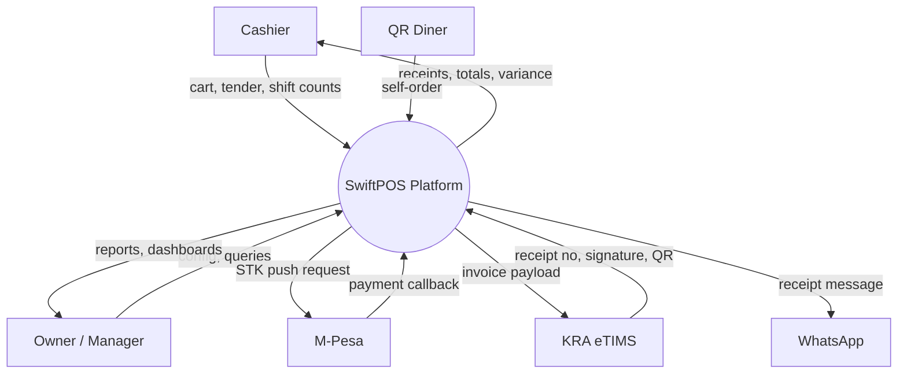
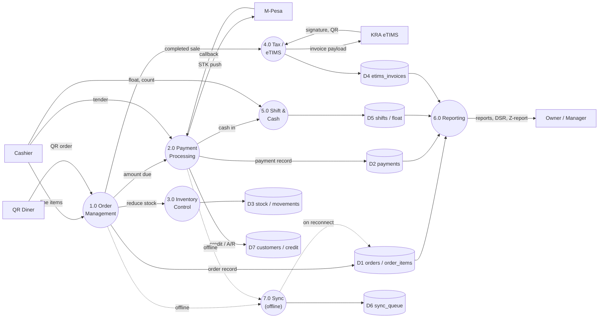
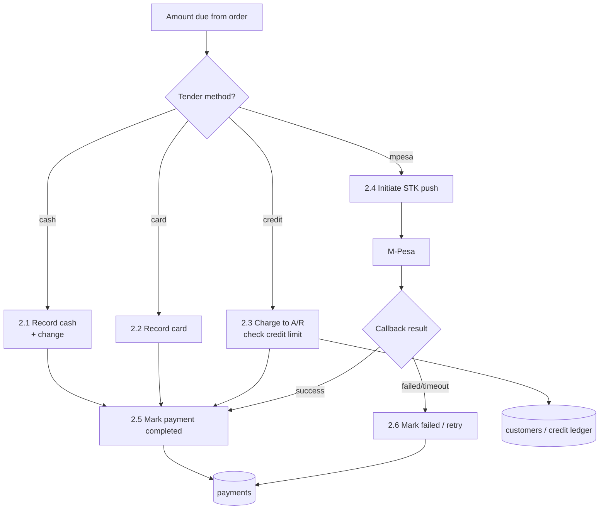
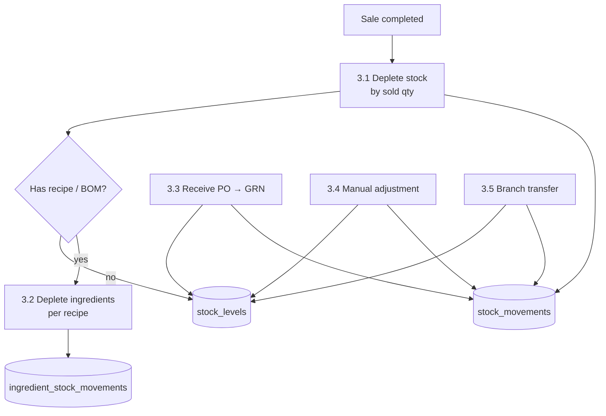

# 4. Data Flow Diagrams

DFD notation used here: rounded boxes = **processes**, square boxes = **external
entities**, and `[( … )]` cylinders = **data stores**.

## 4.1 Level 0 — Context diagram

The whole platform as a single process, showing the main data exchanges.

## 4.2 Level 1 — Major processes

## 4.3 Level 2 — Payment processing (2.0 expanded)

## 4.4 Level 2 — Inventory control (3.0 expanded)

