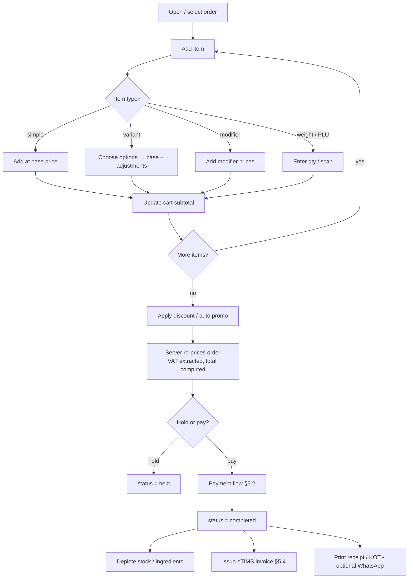
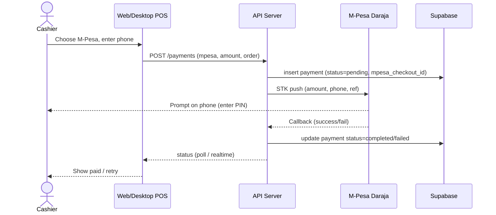
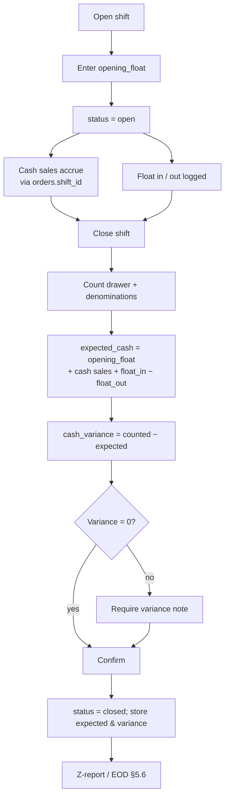
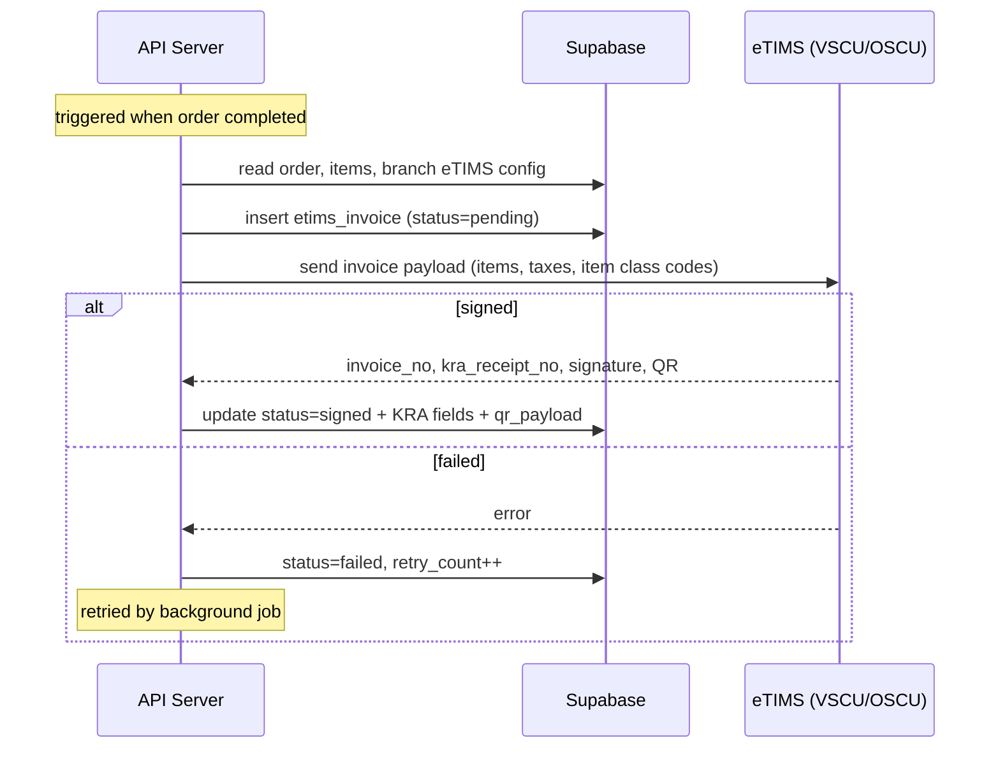
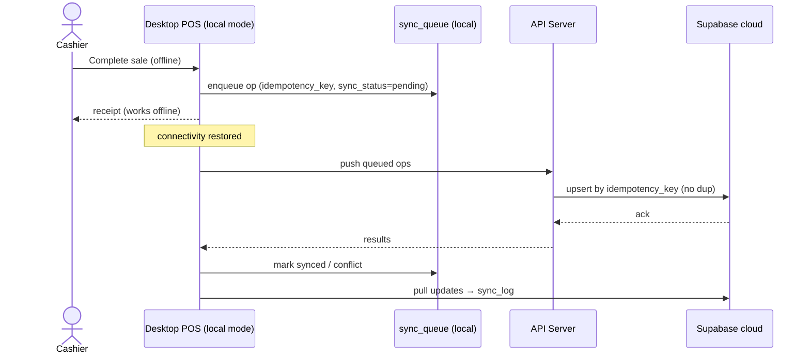
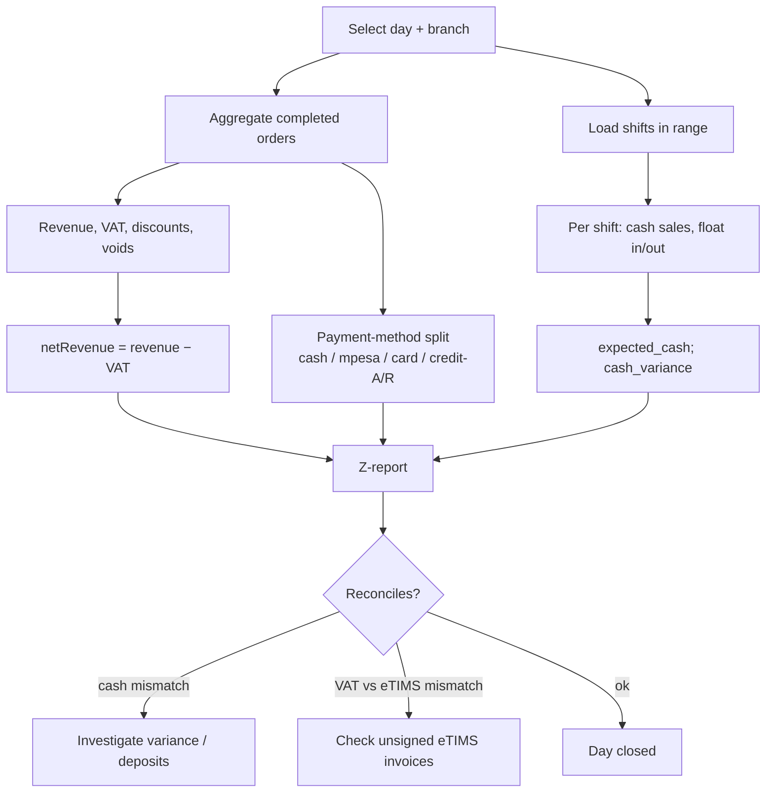
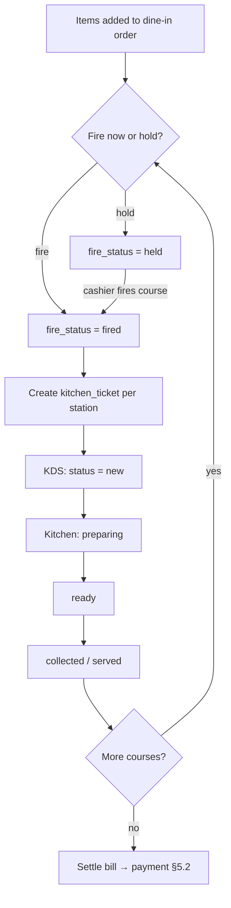

# 5. Process Flows

Flowcharts and sequence diagrams for the core operational flows.

## 5.1 Sale / checkout (cashier)

## 5.2 Payment — M-Pesa STK push (sequence)

## 5.3 Shift open → sales → close & reconcile

## 5.4 eTIMS e-invoice (sequence)

## 5.5 Offline-first sync

## 5.6 EOD / Z-report & reconciliation

## 5.7 Restaurant — KOT firing & course management

